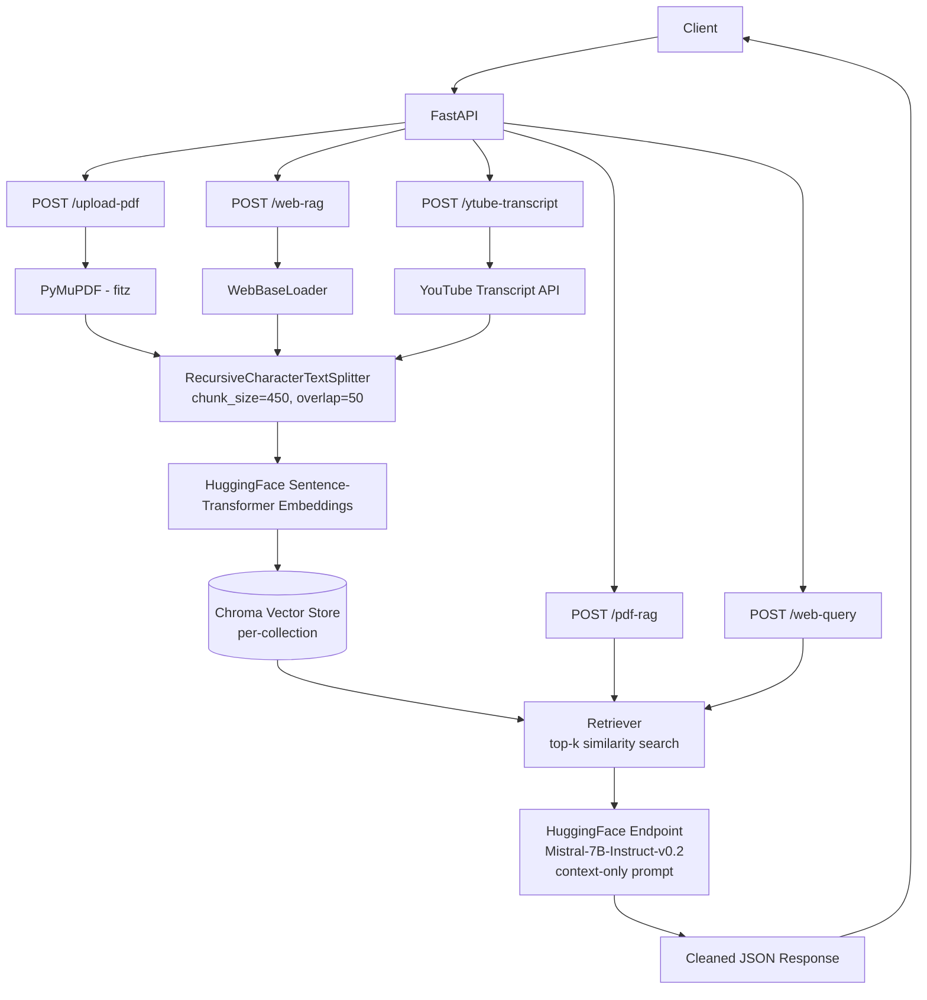

# Multi-Source RAG API

A FastAPI backend that implements Retrieval-Augmented Generation (RAG) over three distinct content sources — **PDF documents**, **web pages**, and **YouTube video transcripts** — through a single, unified service. Each source is chunked, embedded, and stored in its own isolated vector collection, then queried against an open-source LLM to produce grounded, context-only answers.

## Overview

Most RAG demos handle a single content type. This project generalizes the pattern across three ingestion pipelines that all converge on the same embedding, storage, and retrieval logic — giving a client the ability to build a knowledge base from a PDF, a website, or a YouTube video, and query any of them through a consistent API contract.

The system is strict about grounding: the LLM is instructed to answer **only** from retrieved context, and to respond with `"no"` when the context doesn't contain the answer — reducing hallucinated responses.

## Features

- **PDF ingestion** — upload a PDF, extract text page-by-page with PyMuPDF, chunk, embed, and index it
- **Web ingestion** — scrape any static HTML page via `WebBaseLoader`, clean its metadata, chunk, embed, and index it
- **YouTube ingestion** — pull an English transcript via the YouTube Transcript API, chunk, embed, index it, and answer a question against it in a single request
- **Isolated collections** — every ingestion call creates a unique, UUID-named Chroma collection, so sources never bleed into each other
- **Context-grounded answers** — a strict prompt template forces the LLM to answer only from retrieved chunks or explicitly say `"no"`
- **Reasoning-model output cleanup** — strips `<think>...</think>` blocks from LLM responses before returning them
- **CORS-enabled** — ready to be called directly from a frontend during development

## Architecture




## Tech Stack

| Layer | Technology |
|---|---|
| API framework | FastAPI, Uvicorn |
| Orchestration | LangChain, LangChain Community, LangChain Experimental |
| PDF parsing | PyMuPDF (`fitz`) |
| Web scraping | LangChain `WebBaseLoader`, BeautifulSoup4 |
| YouTube transcripts | `youtube-transcript-api` |
| Embeddings | HuggingFace Sentence-Transformers |
| Vector store | ChromaDB (`langchain-chroma`) |
| LLM inference | HuggingFace Inference Endpoint — Mistral-7B-Instruct-v0.2 |
| Validation | Pydantic |

## API Endpoints

### `GET /`
Health check / welcome message.

### `POST /upload-pdf`
Uploads a PDF, extracts and chunks its text, embeds it, and stores it in a new Chroma collection.
- **Body:** multipart file upload
- **Returns:** `{ "message": "<collection_name>" }`

### `POST /pdf-rag`
Answers a question against a previously uploaded PDF's collection.
- **Body:** `{ "collection_name": str, "question": str }`
- **Returns:** `{ "message": "<answer>" }`

### `POST /web-rag`
Scrapes a static web page, chunks and embeds its content into a new collection.
- **Body:** `{ "web_url": str }`
- **Returns:** `{ "message": "<collection_name>" }`

### `POST /web-query`
Answers a question against a previously scraped web page's collection.
- **Body:** `{ "collection_name": str, "question": str }`
- **Returns:** `{ "message": "<answer>" }`

### `POST /ytube-transcript`
Fetches a YouTube video's English transcript, chunks and embeds it, and answers a question — all in one call.
- **Body:** `{ "video_id": str, "question": str }`
- **Returns:** `{ "message": "<answer>" }`, or an error/notice if no English transcript is available

## Getting Started

### Prerequisites
- Python 3.10+
- A HuggingFace account with an [access token](https://huggingface.co/settings/tokens) that has Inference API permissions

### Installation

```bash
git clone <your-repo-url>
cd <repo-name>

python -m venv venv
source venv/bin/activate      # Windows: venv\Scripts\activate

pip install -r requirements.txt
```

### Configuration

Create a `.env` file in the project root:
